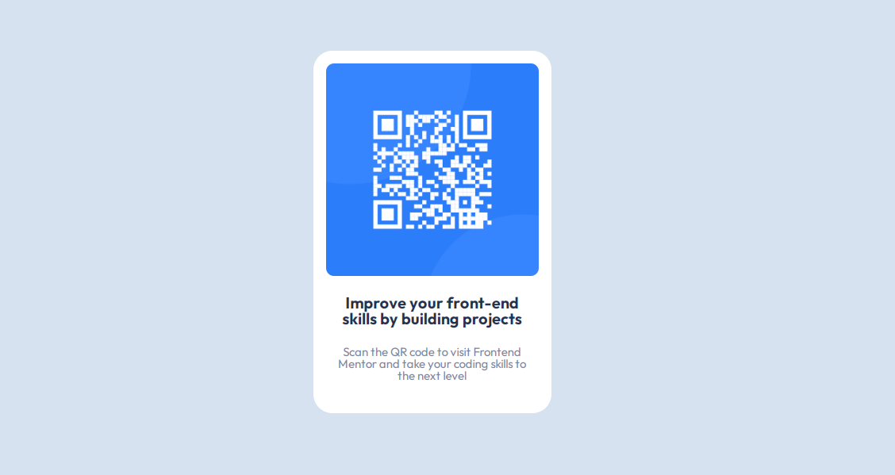

# Frontend Mentor - QR code component solution

This is a solution to the [QR code component challenge on Frontend Mentor](https://www.frontendmentor.io/challenges/qr-code-component-iux_sIO_H). Frontend Mentor challenges help you improve your coding skills by building realistic projects.

## Table of contents

- [Overview](#overview)
  - [Screenshot](#screenshot)
  - [Links](#links)
- [My process](#my-process)
  - [Built with](#built-with)
  - [Continued development](#continued-development)
- [Author](#author)

## Overview

### Screenshot

above when you add your screenshot. If you prefer not to add a screenshot, feel free to remove this entire section.\*\*

### Links

- Solution URL: [github](https://github.com/rohitKumar38344/QR-code-component-solution)
- Live Site URL: [live](https://qr-code-componentsoln.netlify.app/)

## My process

### Built with

- Semantic HTML5 markup
- CSS custom properties
- Flexbox

### Continued development

Layout improvements

## Author

- Website - [RohitKumar](https://github.com/rohitKumar38344)
- Frontend Mentor - [@rohitKumar38344](https://www.frontendmentor.io/profile/rohitKumar38344)
- Twitter - [@\_iamrohitKumar](https://twitter.com/_iamrohitKumar)
